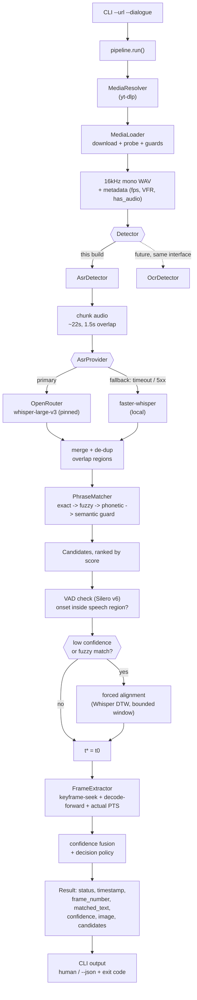

# Approach

The 5-minute version of this project. Full depth — assumptions, interfaces, threshold values, testing strategy, phased roadmap — lives in [`DESIGN.md`](DESIGN.md); this document deliberately points back there instead of restating it.

## TL;DR

- **Input:** a video URL + a target line of dialogue.
- **Output:** the exact **timestamp**, **frame number**, **matched text**, **confidence**, and the **rendered frame image** — plus a `FOUND / AMBIGUOUS / NOT_FOUND / PROCESSING_ERROR` status, never a silent guess.
- **How:** ASR (word-level timestamps) → fuzzy/phonetic phrase match → VAD + optional forced-alignment onset refinement → PTS-accurate frame seek.
- **Interface:** a synchronous CLI. No OCR, no job queue, no HTTP API — all deliberately deferred (see below).
- **Proof it works:** [`BENCHMARK_RESULTS.md`](BENCHMARK_RESULTS.md) — 9/9 synthetic scenarios correct, median onset error 44ms, 100% within ±1 frame.

## The problem, as understood

- Given a video URL + dialogue line, find the **first frame where that line is spoken** — no human watches the video.
- The assignment's wording ("on-screen dialogue", "extracts the text") reads OCR-flavored, but the one worked example (ok.ru clip, *"My mind rebels at stagnation"*) is **spoken audio with no burned-in text**.
- Rather than silently pick a reading, this is a stated, documented assumption (DESIGN.md **A1**): **this build is spoken-dialogue search via ASR**, with OCR designed in as a pluggable `Detector` that isn't implemented yet.
- If an eval video turns out to be subtitle-only: adding OCR is one new class behind an existing interface, not a rewrite. Full defense: DESIGN.md §20.

## Architecture

- Everything left of `Result` depends only on **interfaces** (`Detector`, `AsrProvider`, `PhraseMatcher`, `FrameExtractor`) — `pipeline.py` never imports a concrete implementation.
- The dashed `OcrDetector` branch is the extensibility point: same `Detector` contract, zero pipeline changes to add it.

## Decisions that actually mattered

| Decision | Why | Trade-off accepted |
|---|---|---|
| **ASR-first, OCR deferred** | The one worked example is spoken audio; the phrase is supplied, not discovered | If an eval video is subtitle-only, this pass alone returns `NOT_FOUND` — mitigated by the `Detector` seam |
| **Cloud-primary ASR (pinned OpenRouter) + local `faster-whisper` fallback**, one `AsrProvider` interface | Pinning the backing host is what actually returns word-level timestamps — auto-routing can silently downgrade to segment-only | Even pinned, OpenRouter can drift the underlying model version over time — reproducibility risk named, not engineered away |
| **Every request chunked** (~22s, 1.5s overlap), not just long videos | The cloud endpoint enforces a hard per-request timeout — this is a correctness constraint | Overlap region gets transcribed twice; de-duplicated by time-proximity at merge |
| **Frame mapping via actual decoded PTS + keyframe-seek**, never `round(t * fps)` | fps arithmetic breaks on VFR video and on containers with a non-zero start offset — both real, not invented | More decoder work (seek-before + decode-forward); `frame_number` reported `null` on genuine VFR (the spec's own "where applicable") |
| **Graded matching (fuzzy + phonetic, semantic as a guard) with explicit `AMBIGUOUS`** | ASR transcripts are never exact strings; can't be exact-match-or-nothing, but also can't silently "close enough" | Threshold tuning; `matched_text` always shows what was *actually* recognized (e.g. "at" vs. "against" stays visible, never silently accepted) |

## Deliberately out of scope

- **OCR** — the seam exists (`Detector` interface); not implemented this pass.
- **Job queue / concurrency** — one-video-at-a-time interview task; ASR is the long pole if that changes.
- **HTTP API** — CLI is the only interface for v1.
- **Production hardening** — rate limiting, auth, enterprise sandboxing.

Full list + what each would take to add: DESIGN.md §2.3, §13.

## Where the rest lives

| Doc | What's in it |
|---|---|
| [`DESIGN.md`](DESIGN.md) | Full spec: formal problem statement, all documented assumptions (A1–A11), matching/confidence math, frame-extraction timeline bookkeeping, security guardrails, evaluation methodology, testing strategy, phased roadmap |
| [`PROMPTS.md`](PROMPTS.md) | Every prompt used, verbatim — design-time planning chat + every phase's implementation prompt |
| [`DECISIONS.md`](DECISIONS.md) | The user's own record of why certain design-doc proposals were revised mid-build (e.g. the semantic-guard provider) |
| [`BENCHMARK_RESULTS.md`](BENCHMARK_RESULTS.md) | Mini-benchmark results table (§15), regenerated by `scripts/run_benchmark.py` |
| [`README.md`](README.md) | How to actually install and run this |
